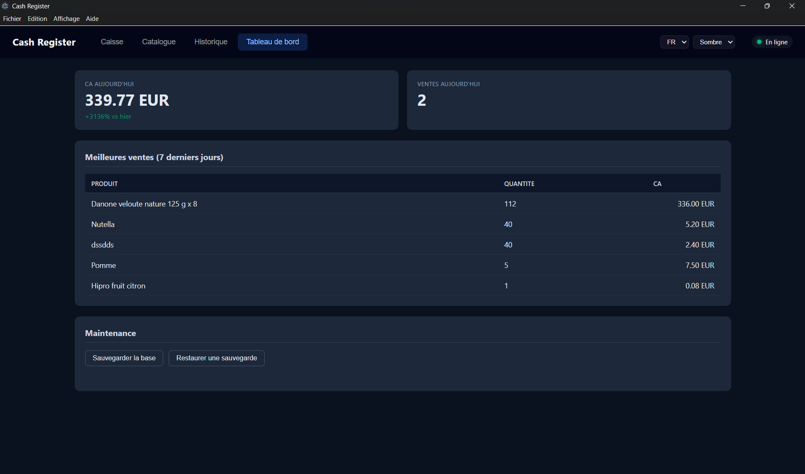
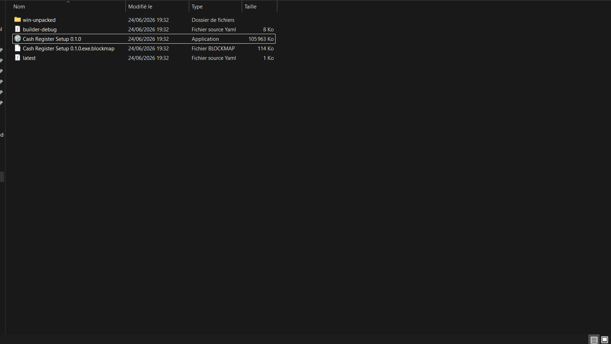
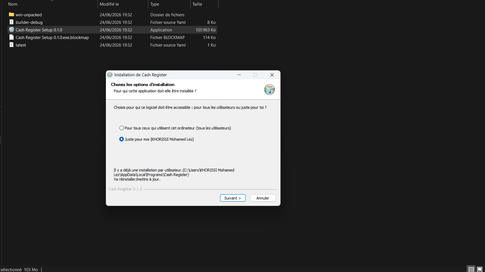
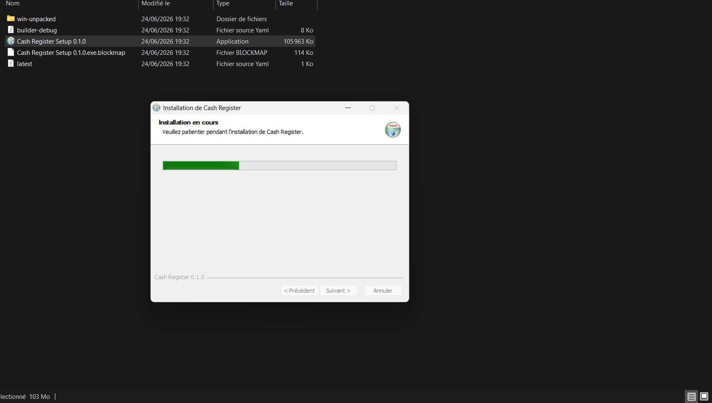
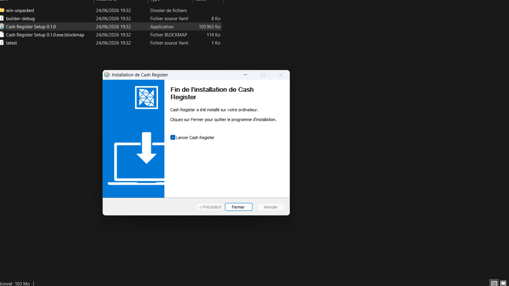
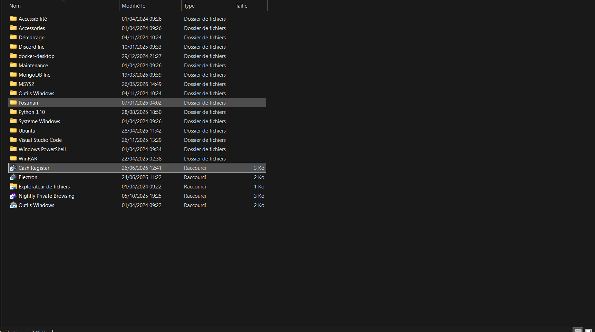

# Cash Register

Logiciel de caisse pour une épicerie de quartier, construit avec **Electron**.

Gestion du catalogue produits (avec recherche automatique via **OpenFoodFacts**),
encaissement, historique des ventes, exports CSV / PDF, tableau de bord, import en masse,
sauvegarde/restauration et ticket de caisse.

---

## Prérequis

- [Node.js](https://nodejs.org/) 18 ou supérieur (le projet utilise le `fetch` natif et `node --test`)
- npm (fourni avec Node.js)
- Windows (le packaging est configuré pour produire un installeur `.exe`)

## Installation (développement)

```bash
git clone https://github.com/Moun22/cash-register.git
cd cash-register
npm install
npm run rebuild   # recompile better-sqlite3 pour la version d'Electron
```

> `npm run rebuild` est nécessaire car `better-sqlite3` est un module natif : il doit
> être recompilé pour l'ABI d'Electron (différente de celle de Node.js). À refaire
> après chaque `npm install`.

## Lancement

```bash
npm start
```

## Tests

```bash
npm test
```

73 tests unitaires couvrent la logique métier pure (validation, parsing CSV,
extraction OpenFoodFacts, calculs du tableau de bord, génération CSV, i18n).

## Générer l'installeur Windows

```bash
npm run build:win
```

L'installeur est produit dans `dist/Cash Register Setup 0.1.0.exe`.

---

## Fonctionnalités

| Domaine             | Détails |
|---------------------|---|
| **Catalogue**       | Ajout / édition prix / suppression, recherche, code-barres → OpenFoodFacts |
| **Caisse**          | Recherche produit, panier, quantités, total, validation de la vente |
| **Historique**      | Liste filtrable par date, détail d'une vente, exports CSV / PDF |
| **Tableau de bord** | CA du jour, nombre de ventes, évolution vs hier, meilleures ventes (7 j) |
| **Hors ligne**      | Indicateur de connexion + cache OpenFoodFacts pour continuer à scanner |
| **Préférences**     | Langue FR/EN et thème clair/sombre, persistés |
| **Autres**          | Import CSV en masse, sauvegarde/restauration de la base, ticket de caisse PDF |

---

## Captures

### L'application installée et lancée (preuve du packaging)

L'application ci-dessous tourne depuis sa **version installée** (et non `npm start`) :
on y voit le tableau de bord, le thème sombre et la langue sélectionnés.



### Installation (installeur NSIS)

L'installeur généré par `electron-builder` (`dist/Cash Register Setup 0.1.0.exe`) :



| Étape | Capture |
|---|---|
| Choix des options |  |
| Installation en cours |  |
| Fin de l'installation |  |

### Raccourci installé dans le menu Démarrer



---

## Où sont stockées les données ?

Tout est dans le dossier `userData` de l'application (jamais à côté du code) :

- **Windows** : `%APPDATA%\cash-register\`
  - `cash-register.db` : base SQLite (produits, ventes, lignes, préférences, cache)

Cet emplacement survit aux mises à jour de l'application et est propre à chaque OS.

---

## Documentation

Le **dossier de conception** (modèle de données, architecture et choix justifiés)
est disponible dans [`docs/CONCEPTION.md`](docs/CONCEPTION.md).
